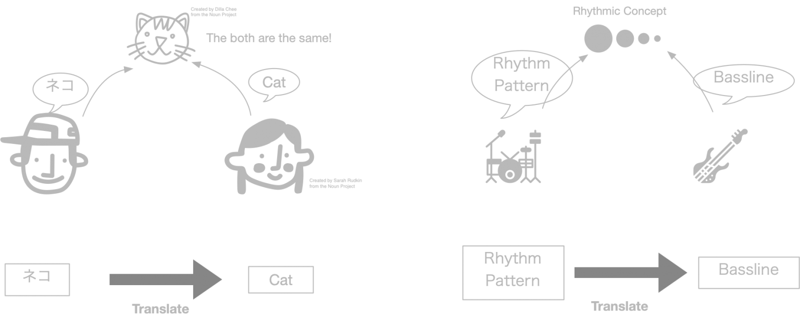
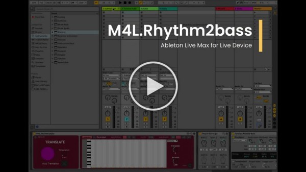

# M4L.Rhythm2Bass Ableton Live Max for Live Device

M4L.Rhythm2Bass: Ableton Live Max for Live Device for translating drum patterns into basslines. The device uses a seq-to-seq model, normally used for language translation tasks, trained on house music MIDI files containing both drum and bass tracks.

The basic assumption behind this device is the following: A drum pattern and its corresponding bass line, they are speaking the same rhythmical concept in two different languages.




# How it works
<a href="https://www.youtube.com/watch?v=P0uP80q-2xg"></a>


Reference:
```
Behzad Haki, & Jorda, S. (2019). A Bassline Generation System Based on Sequence-to-Sequence Learning. Proceedings of the International Conference on New Interfaces for Musical Expression, 204–209. 
```